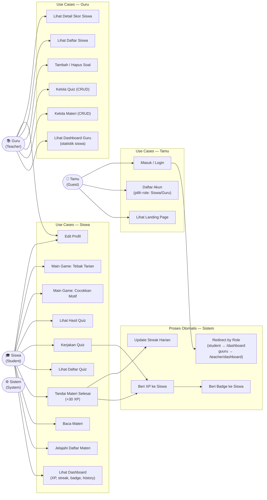
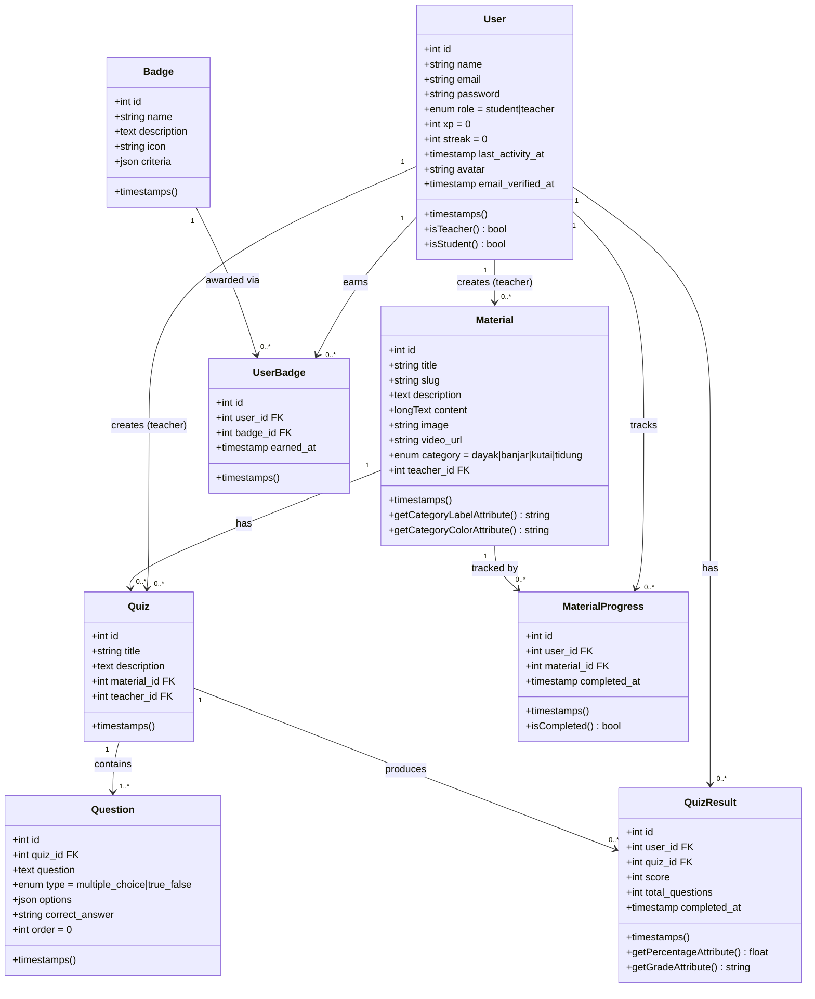
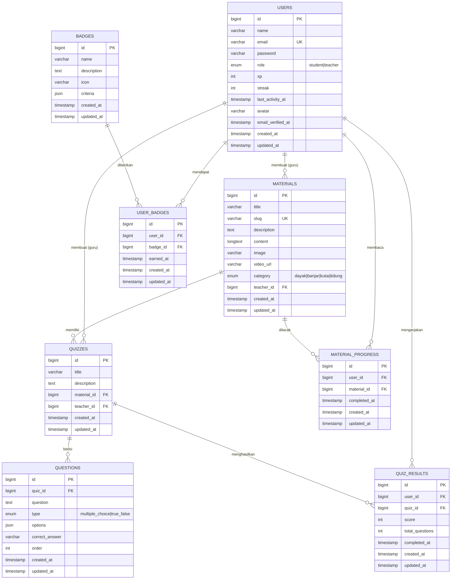
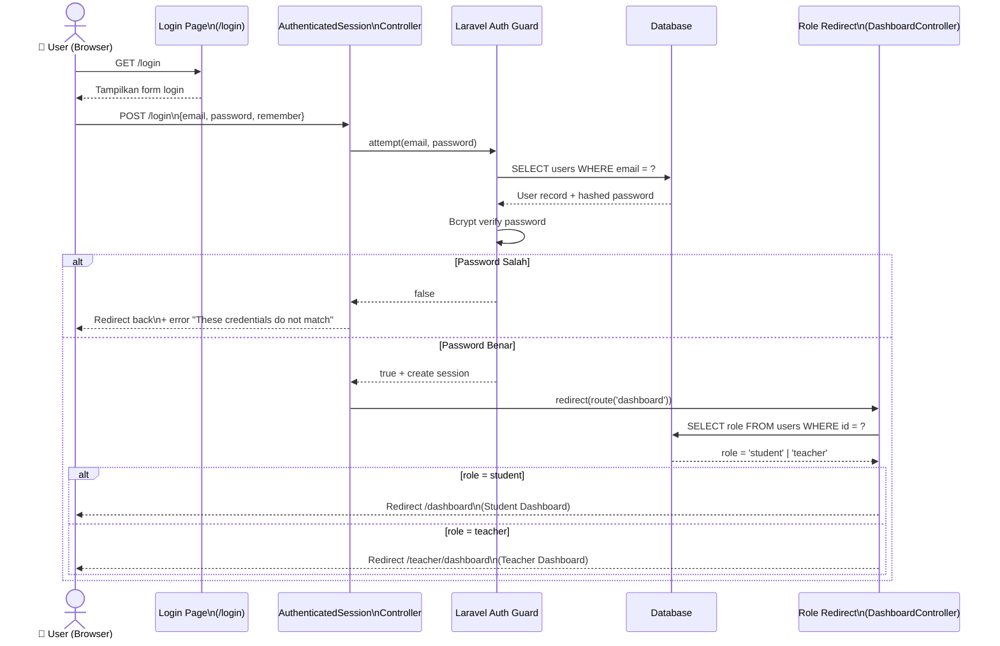
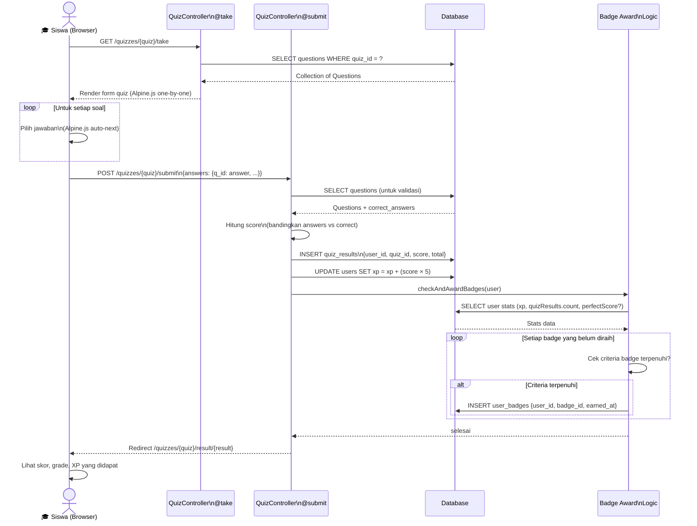
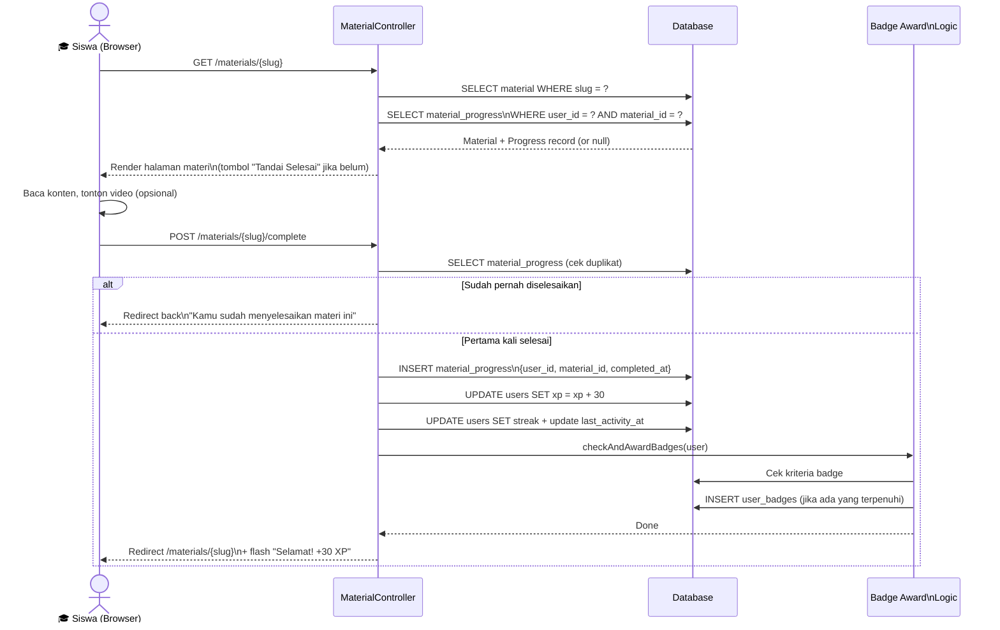

# UML Diagrams — Kaltara Budaya

Semua diagram menggunakan **Mermaid** syntax.
Render di: VS Code (ext. Mermaid Preview), GitHub, Notion, draw.io (import), atau https://mermaid.live

---

## 1. Use Case Diagram



---

## 2. Class Diagram



---

## 3. Entity Relationship Diagram (ERD)



---

## 4. User Flow — Tamu (Guest)

```mermaid
flowchart TD
    START([🌐 Buka Website]) --> LP[Halaman Landing Page]

    LP --> LP1[Lihat Hero Section]
    LP1 --> LP2[Scroll: Lihat 4 Suku Budaya]
    LP2 --> LP3[Scroll: Lihat Fitur Platform]
    LP3 --> LP4[Scroll: Lihat Gamifikasi / Badge]
    LP4 --> LP5[Lihat CTA Daftar]

    LP5 --> CHOICE{Pilihan User}

    CHOICE -->|Klik 'Daftar Sekarang'| REG[Halaman Register\n/register]
    CHOICE -->|Klik 'Masuk'| LGN[Halaman Login\n/login]
    CHOICE -->|Sudah login| DASH[Redirect ke Dashboard]

    REG --> REG1[Isi Nama, Email, Password]
    REG1 --> REG2[Pilih Role:\n🎓 Siswa  atau  📚 Guru]
    REG2 --> REG3{Validasi}
    REG3 -->|Gagal| REG4[Tampil Error Validasi]
    REG4 --> REG1
    REG3 -->|Berhasil| REG5[Akun Dibuat + Auto Login]
    REG5 --> REDIRECT

    LGN --> LGN1[Isi Email & Password]
    LGN1 --> LGN2{Autentikasi}
    LGN2 -->|Gagal| LGN3[Tampil Error: Email/password salah]
    LGN3 --> LGN1
    LGN2 -->|Berhasil| REDIRECT

    REDIRECT{Cek Role User}
    REDIRECT -->|role = student| STUDENT_DASH[/dashboard\nDashboard Siswa]
    REDIRECT -->|role = teacher| TEACHER_DASH[/teacher/dashboard\nDashboard Guru]
```

---

## 5. User Flow — Siswa (Student)

```mermaid
flowchart TD
    ENTRY([✅ Login sebagai Siswa]) --> DASH

    DASH[Dashboard Siswa\n/dashboard]
    DASH --> DASH1[Lihat XP, Streak, Badge]
    DASH --> DASH2[Lihat Hasil Quiz Terbaru]
    DASH --> DASH3[Lihat Rekomendasi Materi]

    DASH --> NAV{Pilih Menu}

    NAV -->|📖 Materi| MAT_INDEX[Daftar Materi\n/materials]
    NAV -->|🧠 Quiz| QUIZ_INDEX[Daftar Quiz\n/quizzes]
    NAV -->|🎮 Mini Game| GAME_MENU[Pilih Game]
    NAV -->|Profil| PROFILE[Edit Profil\n/profile]
    NAV -->|Logout| LOGOUT([🚪 Keluar])

    %% ── MATERI FLOW ──
    MAT_INDEX --> MAT_FILTER[Filter Suku:\nSemua / Dayak / Banjar / Kutai / Tidung]
    MAT_FILTER --> MAT_CARD[Klik Card Materi]
    MAT_CARD --> MAT_SHOW[Detail Materi\n/materials/{slug}]
    MAT_SHOW --> MAT_READ[Baca Konten Materi]
    MAT_READ --> MAT_VIDEO{Ada Video?}
    MAT_VIDEO -->|Ya| MAT_WATCH[Tonton Video Embed]
    MAT_VIDEO -->|Tidak| MAT_STATUS
    MAT_WATCH --> MAT_STATUS

    MAT_STATUS{Sudah Selesai?}
    MAT_STATUS -->|Sudah| MAT_DONE[Tampil: ✓ Sudah Selesai]
    MAT_STATUS -->|Belum| MAT_BTN[Klik 'Tandai Selesai +30 XP']
    MAT_BTN --> MAT_COMPLETE[POST /materials/{slug}/complete]
    MAT_COMPLETE --> MAT_XP[+30 XP diberikan\nStreak diupdate\nBadge dicek]
    MAT_XP --> MAT_DONE
    MAT_DONE --> MAT_QUIZ{Ada Quiz Terkait?}
    MAT_QUIZ -->|Ya| MAT_QUIZ_LINK[Klik Quiz Terkait →]
    MAT_QUIZ_LINK --> QUIZ_TAKE
    MAT_QUIZ -->|Tidak| MAT_INDEX

    %% ── QUIZ FLOW ──
    QUIZ_INDEX --> QUIZ_CARD[Lihat Quiz + Skor Terbaik]
    QUIZ_CARD --> QUIZ_BTN[Klik 'Mulai Quiz' / 'Coba Lagi']
    QUIZ_BTN --> QUIZ_TAKE[Halaman Kerjakan Quiz\n/quizzes/{id}/take]
    QUIZ_TAKE --> QUIZ_Q[Baca Soal Satu per Satu\n(navigasi prev/next)]
    QUIZ_Q --> QUIZ_ANSWER[Pilih Jawaban\n(auto-next setelah pilih)]
    QUIZ_ANSWER --> QUIZ_MORE{Masih Ada Soal?}
    QUIZ_MORE -->|Ya| QUIZ_Q
    QUIZ_MORE -->|Soal Terakhir| QUIZ_SUBMIT[Klik 'Kumpulkan Jawaban']
    QUIZ_SUBMIT --> QUIZ_VALIDATE{Semua Dijawab?}
    QUIZ_VALIDATE -->|Belum semua\n(konfirmasi)| QUIZ_CONFIRM[Konfirmasi Browser]
    QUIZ_CONFIRM -->|Cancel| QUIZ_Q
    QUIZ_CONFIRM -->|OK| QUIZ_PROCESS
    QUIZ_VALIDATE -->|Semua dijawab| QUIZ_PROCESS

    QUIZ_PROCESS[POST /quizzes/{id}/submit\nHitung skor + simpan result]
    QUIZ_PROCESS --> QUIZ_XP[+5 XP per jawaban benar\nBadge dicek]
    QUIZ_XP --> QUIZ_RESULT[Halaman Hasil Quiz\n/quizzes/{id}/result/{result}]
    QUIZ_RESULT --> QUIZ_GRADE[Lihat Grade A-E & Persentase]
    QUIZ_RESULT --> QUIZ_DETAIL[Lihat Jawaban Benar Tiap Soal]
    QUIZ_RESULT --> QUIZ_ACTION{Pilihan}
    QUIZ_ACTION -->|Coba Lagi| QUIZ_TAKE
    QUIZ_ACTION -->|Kembali ke Quiz List| QUIZ_INDEX
    QUIZ_ACTION -->|Dashboard| DASH

    %% ── GAME FLOW ──
    GAME_MENU --> GAME1[Game 1: Cocokkan Motif\n/games/matching]
    GAME_MENU --> GAME2[Game 2: Tebak Tarian\n/games/guess-dance]

    GAME1 --> G1_PLAY[Klik Motif → Klik Nama Suku]
    G1_PLAY --> G1_MATCH{Cocok?}
    G1_MATCH -->|✓ Benar| G1_GREEN[Feedback Hijau + Toast]
    G1_MATCH -->|✗ Salah| G1_RED[Feedback Merah + Toast]
    G1_GREEN --> G1_MORE{Semua 4 Pasang Selesai?}
    G1_RED --> G1_MORE
    G1_MORE -->|Belum| G1_PLAY
    G1_MORE -->|Ya| G1_RESULT[Tampil Skor & Opsi: Main Lagi / Game 2]

    GAME2 --> G2_QUESTION[Lihat Gambar + Petunjuk Tarian]
    G2_QUESTION --> G2_ANSWER[Klik Jawaban Suku]
    G2_ANSWER --> G2_CORRECT{Benar?}
    G2_CORRECT -->|Ya| G2_SCORE[+1 Skor]
    G2_CORRECT -->|Tidak| G2_EXPLAIN[Tampil Penjelasan]
    G2_SCORE --> G2_NEXT{Soal Berikutnya?}
    G2_EXPLAIN --> G2_NEXT
    G2_NEXT -->|Ada| G2_QUESTION
    G2_NEXT -->|Habis| G2_RESULT[Layar Hasil: Skor/5 & Rating]
    G2_RESULT --> G2_ACTION{Aksi}
    G2_ACTION -->|Main Lagi| G2_QUESTION
    G2_ACTION -->|Game 1| GAME1
    G2_ACTION -->|Dashboard| DASH
```

---

## 6. User Flow — Guru (Teacher)

```mermaid
flowchart TD
    ENTRY([✅ Login sebagai Guru]) --> TDASH

    TDASH[Dashboard Guru\n/teacher/dashboard]
    TDASH --> STATS[Lihat Statistik:\nTotal Siswa, Materi, Quiz, Avg Skor]
    TDASH --> RECENT[Lihat Pengerjaan Quiz Terbaru]
    TDASH --> LATEST[Lihat Materi Terbaru]

    TDASH --> TNAV{Pilih Menu}
    TNAV -->|📖 Materi Saya| TMAT_INDEX[Daftar Materi Saya\n/teacher/materials]
    TNAV -->|🧠 Quiz Saya| TQUIZ_INDEX[Daftar Quiz Saya\n/teacher/quizzes]
    TNAV -->|👥 Data Siswa| TSTUDENT_INDEX[Daftar Siswa\n/teacher/students]
    TNAV -->|Profil| TPROFILE[Edit Profil\n/profile]
    TNAV -->|Logout| TLOGOUT([🚪 Keluar])

    %% ── MATERI CRUD ──
    TMAT_INDEX --> TMAT_TABLE[Lihat Tabel Materi\n(Judul, Kategori, Aksi)]
    TMAT_TABLE --> TMAT_ACTION{Pilihan Aksi}

    TMAT_ACTION -->|+ Tambah Materi| TMAT_CREATE[Form Tambah Materi\n/teacher/materials/create]
    TMAT_CREATE --> TMAT_FILL[Isi: Judul, Kategori, Deskripsi,\nKonten HTML, Gambar, URL Video]
    TMAT_FILL --> TMAT_VALIDATE{Validasi}
    TMAT_VALIDATE -->|Gagal| TMAT_ERROR[Tampil Error Validasi]
    TMAT_ERROR --> TMAT_FILL
    TMAT_VALIDATE -->|Berhasil| TMAT_SAVE[POST /teacher/materials\nSimpan ke DB + Upload Gambar]
    TMAT_SAVE --> TMAT_INDEX

    TMAT_ACTION -->|Lihat| TMAT_SHOW[Detail Materi\n/teacher/materials/{id}]
    TMAT_SHOW --> TMAT_BACK[← Kembali ke List]

    TMAT_ACTION -->|Edit| TMAT_EDIT[Form Edit Materi\n/teacher/materials/{id}/edit]
    TMAT_EDIT --> TMAT_UPDATE[PATCH /teacher/materials/{id}]
    TMAT_UPDATE --> TMAT_INDEX

    TMAT_ACTION -->|Hapus| TMAT_CONFIRM{Konfirmasi Hapus?}
    TMAT_CONFIRM -->|Batal| TMAT_TABLE
    TMAT_CONFIRM -->|Hapus| TMAT_DELETE[DELETE /teacher/materials/{id}]
    TMAT_DELETE --> TMAT_INDEX

    %% ── QUIZ CRUD ──
    TQUIZ_INDEX --> TQUIZ_TABLE[Lihat Tabel Quiz\n(Judul, Soal, Aksi)]
    TQUIZ_TABLE --> TQUIZ_ACTION{Pilihan Aksi}

    TQUIZ_ACTION -->|+ Buat Quiz| TQUIZ_CREATE[Form Buat Quiz\n/teacher/quizzes/create]
    TQUIZ_CREATE --> TQUIZ_FILL[Isi: Judul, Deskripsi,\nKaitkan ke Materi]
    TQUIZ_FILL --> TQUIZ_SAVE[POST /teacher/quizzes\nRedirect ke Kelola Soal]
    TQUIZ_SAVE --> TQUIZ_SHOW

    TQUIZ_ACTION -->|Kelola Soal| TQUIZ_SHOW[Kelola Soal Quiz\n/teacher/quizzes/{id}]
    TQUIZ_SHOW --> TQUIZ_QLIST[Lihat Daftar Soal yang Ada]
    TQUIZ_SHOW --> TQUIZ_ADD_BTN[Klik 'Tambah Soal Baru']
    TQUIZ_ADD_BTN --> TQUIZ_TYPE{Pilih Tipe Soal}
    TQUIZ_TYPE -->|Pilihan Ganda| TQUIZ_MC[Isi 4 Opsi + Pilih Jawaban Benar]
    TQUIZ_TYPE -->|Benar/Salah| TQUIZ_TF[Pilih: Benar atau Salah]
    TQUIZ_MC --> TQUIZ_SUBMIT_Q[POST /teacher/quizzes/{id}/questions]
    TQUIZ_TF --> TQUIZ_SUBMIT_Q
    TQUIZ_SUBMIT_Q --> TQUIZ_SHOW

    TQUIZ_ACTION -->|Edit Info| TQUIZ_EDIT[Form Edit Quiz]
    TQUIZ_EDIT --> TQUIZ_UPDATE[PATCH /teacher/quizzes/{id}]
    TQUIZ_UPDATE --> TQUIZ_INDEX

    TQUIZ_ACTION -->|Hapus Quiz| TQUIZ_DEL_CONFIRM{Konfirmasi?}
    TQUIZ_DEL_CONFIRM -->|Batal| TQUIZ_TABLE
    TQUIZ_DEL_CONFIRM -->|Hapus| TQUIZ_DELETE[DELETE /teacher/quizzes/{id}]
    TQUIZ_DELETE --> TQUIZ_INDEX

    TQUIZ_QLIST --> TQUIZ_HAPUS_Q{Hapus Soal?}
    TQUIZ_HAPUS_Q -->|Ya| TQUIZ_DEL_Q[DELETE questions/{id}]
    TQUIZ_DEL_Q --> TQUIZ_SHOW

    %% ── DATA SISWA ──
    TSTUDENT_INDEX --> TSTUDENT_TABLE[Lihat Tabel Siswa\n(Nama, XP, Streak, Badge, Quiz Dikerjakan)]
    TSTUDENT_TABLE --> TSTUDENT_CLICK[Klik Nama Siswa]
    TSTUDENT_CLICK --> TSTUDENT_SHOW[Detail Siswa\n/teacher/students/{id}]
    TSTUDENT_SHOW --> TSTUDENT_SCORE[Lihat Semua Hasil Quiz Siswa]
    TSTUDENT_SHOW --> TSTUDENT_BADGE[Lihat Badge yang Diraih]
    TSTUDENT_SHOW --> TSTUDENT_BACK[← Kembali ke List]
```

---

## 7. Sequence Diagram — Login & Role Redirect



---

## 8. Sequence Diagram — Kerjakan Quiz & Award XP



---

## 9. Sequence Diagram — Baca Materi & Complete



---

## 10. Activity Diagram — Sistem Pemberian Badge

```mermaid
flowchart TD
    START([Trigger: Selesai Materi ATAU Submit Quiz]) --> LOAD_USER

    LOAD_USER[Load User dengan Stats:\nxp, quizResults, materialProgress, badges]

    LOAD_USER --> CHECK_ALL[Loop: Cek Semua Badge]

    CHECK_ALL --> BADGE1{Badge: Penjelajah Budaya\n🌿 Selesaikan 1 materi}
    BADGE1 -->|materials_completed >= 1| CHECK_B1_OWN{Sudah punya?}
    CHECK_B1_OWN -->|Belum| AWARD_B1[INSERT user_badges]
    CHECK_B1_OWN -->|Sudah| SKIP1[Skip]
    BADGE1 -->|Belum memenuhi| SKIP1

    AWARD_B1 --> BADGE2
    SKIP1 --> BADGE2

    BADGE2{Badge: Sang Pejuang\n⚔️ Skor sempurna di 1 quiz}
    BADGE2 -->|Ada result dgn score = total| CHECK_B2_OWN{Sudah punya?}
    CHECK_B2_OWN -->|Belum| AWARD_B2[INSERT user_badges]
    CHECK_B2_OWN -->|Sudah| SKIP2[Skip]
    BADGE2 -->|Belum memenuhi| SKIP2

    AWARD_B2 --> BADGE3
    SKIP2 --> BADGE3

    BADGE3{Badge: Bintang Kaltara\n⭐ Selesaikan 4 materi}
    BADGE3 -->|materials_completed >= 4| CHECK_B3_OWN{Sudah punya?}
    CHECK_B3_OWN -->|Belum| AWARD_B3[INSERT user_badges]
    CHECK_B3_OWN -->|Sudah| SKIP3[Skip]
    BADGE3 -->|Belum memenuhi| SKIP3

    AWARD_B3 --> BADGE4
    SKIP3 --> BADGE4

    BADGE4{Badge: Streak Master\n🔥 Streak >= 7 hari}
    BADGE4 -->|streak >= 7| CHECK_B4_OWN{Sudah punya?}
    CHECK_B4_OWN -->|Belum| AWARD_B4[INSERT user_badges]
    CHECK_B4_OWN -->|Sudah| SKIP4[Skip]
    BADGE4 -->|Belum memenuhi| SKIP4

    AWARD_B4 --> BADGE5
    SKIP4 --> BADGE5

    BADGE5{Badge: Maestro Quiz\n🧙 Kerjakan 5 quiz}
    BADGE5 -->|quiz_results.count >= 5| CHECK_B5_OWN{Sudah punya?}
    CHECK_B5_OWN -->|Belum| AWARD_B5[INSERT user_badges]
    CHECK_B5_OWN -->|Sudah| SKIP5[Skip]
    BADGE5 -->|Belum memenuhi| SKIP5

    AWARD_B5 --> END([✅ Selesai])
    SKIP5 --> END
```


